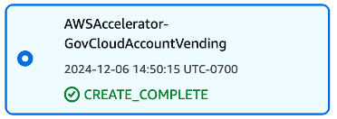

==== Step 2: Install GovCloud Vending Process

You will need access to the root email’s mailbox for these steps.

For Intuitive Machines, the AWS Organization already existed.  There was no need to configure Organizations for the Commercial environment.  The original *management account* for the Organization was *Ryan Necessary - IM*.  We renamed this account to *IM-Comm-Mgt* (ending in 1026).  The following was executed in that account.

[start=1]
. From the service search bar, type *CloudFormation* and select *CloudFormation*
. Select *Stacks* from the menu on the left
. Select the *Create stack* button in the center of the page
. Leave *Choose an existing template* selected
. Leave *Amazon S3 URL* selected under *Specify template*
. For Amazon S3 URL enter: *https://s3.amazonaws.com/solutions-reference/landing-zone-accelerator-on-aws/latest/AWSAccelerator-GovCloudAccountVending.template*
. Select *Next*
. For Stack name, enter: *AWSAccelerator-GovCloudAccountVending*
. Select *Next*
. Scroll to the bottom and select the checkbox next to *I acknowledge that AWS CloudFormation might create IAM resources*.
. Select *Next*
. Scroll to the bottom of the *Review and create* page and select *Submit*

This will begin the creation of the resources needed for vending new accounts.  Wait until that stack displays *CREATE_COMPLETE*.

