==== Step 3: Configure Account Vending and LZA Foundational Accounts

##################################################
##################################################
##################################################
This is the process you will follow when you need to create more accounts in your environment.

##################################################
##################################################
##################################################

In this step we are going to create the additional accounts needed for the Landing Zone. This includes the *Log Archive*, *Audit/Security*, *SharedServices* and *Network* accounts.  As you go through this process, maintain a list of the email addresses you configure for the accounts.  You will need these in step 3.

Once the *AWSAccelerator-GovCloudAccountVending* stack shows *CREATE_COMPLETE*.

[start=1]
. From the service search bar, type *Service Catalog* and select *Service Catalog*
. Under the *Administration* menu on the left, select *Portfolios*
. Click on the text for *Landing Zone Accelerator on AWS*
. Select the *Access* tab
. Select *Grant Access*
. Leave *IAM Principal* selected
. Under *Groups*, select the group that was created earlier.  The one that your current user is in.
. This is refereing to LZA-AdminAccess

. Select *Grant access*
. Select *Products* from the menu on the left. It is under *Provisioning*
. Select the circle next to *Landing Zone Accelerator on AWS – AWS GovCloud (US) Account Vending*
. Select *Launch product*
. For *Provisioned product name* enter *gc_acct_log_archive*

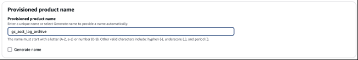

[start=13]
.	Leave *Product versions* as it is
.	Under *Parameters*, enter an *Account name* and *Account email*
.	Change *OrganizationAccountAccessRole* to *AWSControlTowerExecution* under *Organization Role Name*

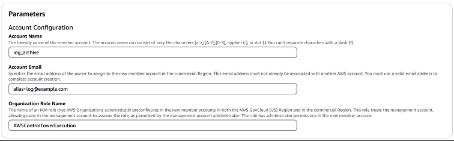

[start=16]
. Select *Launch product*.  This will open the *Provisioned product details* page. Here you can wait for the account to be created by following along under the Resources tab at the bottom of the page.  The account creation process is complete when you see *CREATE_COMPLETE* in the Status column for both CDKMetadata and CustomCreateGovCloudAccount.

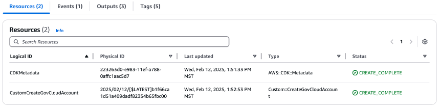

[start=17]
. Select the *Outputs* tab
. Make note of the *GovCloudAccountId* value.  Note it with the email address used to create the account.
. Select *Products* from the menu under *Provisioning*
. Select the circle next to *Landing Zone Accelerator on AWS – AWS GovCloud (US) Account Vending*
. Select *Launch product*
. For *Provisioned product* name enter *gc_acct_audit*

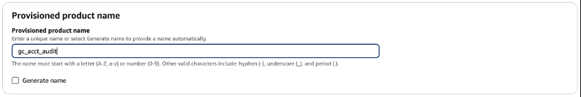

[start=23]
. Leave *Product versions* as it is
. Under *Parameters*, enter an *Account name* and *Account email*
. Change *OrganizationAccountAccessRole* to *AWSControlTowerExecution* under *Organization Role Name*

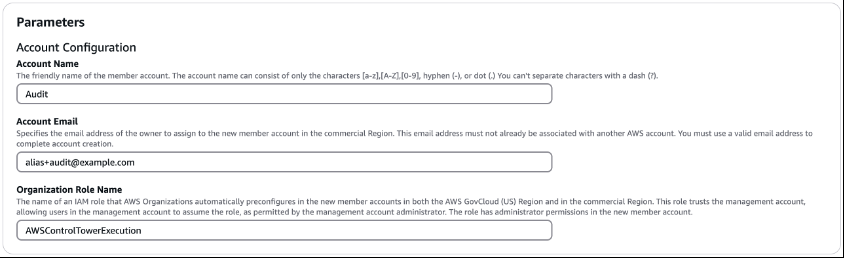

[start=26]
. Select *Launch product*.  This will open the *Provisioned product details* page. Here you can wait for the account to be created by following along under the Resources tab at the bottom of the page.  The account creation process is complete when you see *CREATE_COMPLETE* in the Status column for both CDKMetadata and CustomCreateGovCloudAccount.

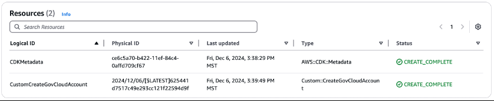

[start=27]
. Select the *Outputs* tab
. Make note of the *GovCloudAccountId* value.  Note it with the email address used to create the account
. Select Products from the menu on the left. It is under *Provisioning*
. Select the circle next to *Landing Zone Accelerator on AWS – AWS GovCloud (US) Account Vending*
. Select *Launch product*
. For *Provisioned product name* enter *gc_acct_network*

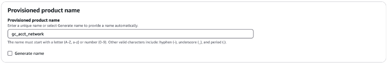

[start=33]
. Leave *Product versions* as it is
. Under *Parameters*, enter an *Account name* and *Account email*
. Change *OrganizationAccountAccessRole* to *AWSControlTowerExecution* under *Organization Role Name*

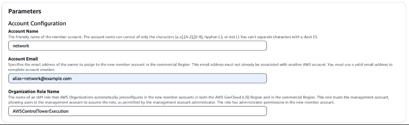

[start=36]
. Select *Launch product*.  This will open the *Provisioned product details* page. Here you can wait for the account to be created by following along under the Resources tab at the bottom of the page.  The account creation process is complete when you see *CREATE_COMPLETE* in the Status column for both CDKMetadata and CustomCreateGovCloudAccount.

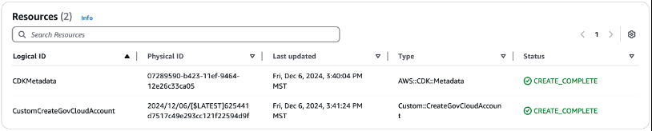

[start=37]
. Select the *Outputs* tab
. Make note of the *GovCloudAccountId* value.  Note it with the email address used to create the account
. Select *Products* from the menu on the left. It is under *Provisioning*
. Select the circle next to *Landing Zone Accelerator on AWS – AWS GovCloud (US) Account Vending*
. Select *Launch product*
. For *Provisioned product name* enter *gc_acct_sharedservices*

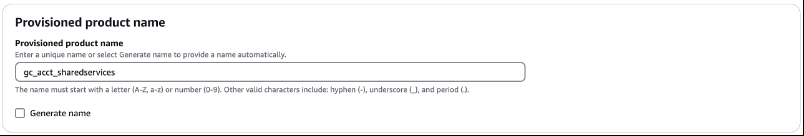

[start=43]
. Leave *Product versions* as it is
. Under *Parameters*, enter an *Account name* and *Account email*
. Change *OrganizationAccountAccessRole* to *AWSControlTowerExecution* under *Organization Role Name*

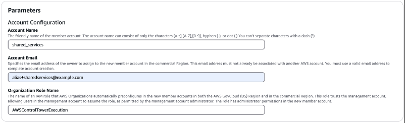

[start=46]
. Select *Launch product*.  This will open the *Provisioned product details* page. Here you can wait for the account to be created by following along under the *Resources* tab at the bottom of the page.  The account creation process is complete when you see *CREATE_COMPLETE* in the Status column for both CDKMetadata and CustomCreateGovCloudAccount.

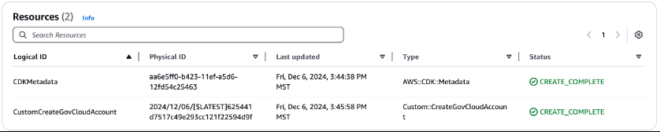

[start=47]
.	Select the *Outputs* tab
.	Make note of the GovCloudAccountId value.  Note it with the email address used to create the account

Once complete, you can see all the provisioned accounts by select *Provisioned products* from under the *Provisioning* menu to view all the created accounts.  At this time, there is nothing more to do in the Commercial account.

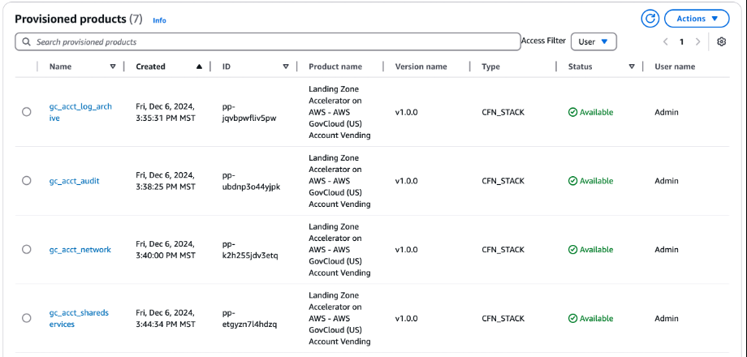
