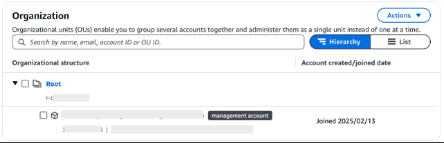
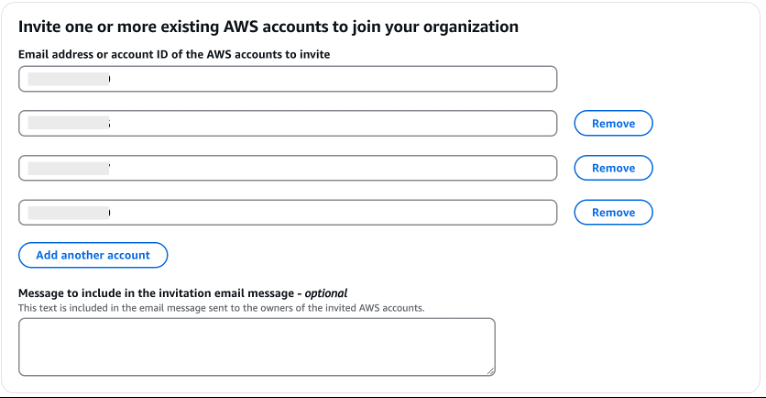
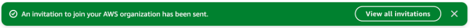
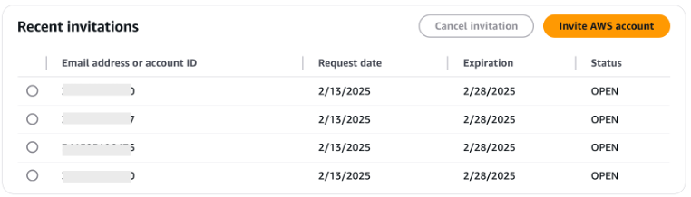

==== Step 4: Configure GovCloud

##########################################
##########################################
##########################################

After you have created the accounts in Step 3 this is the step to get the new account into the management of the IM Root MGT account

##########################################
##########################################
##########################################

An organization already previously existed in the IM environment in GovCloud. There was no need to create one.  One caveat is that the *management account* for the organization is not the account linked to the Commercial *management account*.  The *management account* for the GovCloud partition is *im-root-mgt* (ending in 3751).  These steps are performed in that account.

[start=1]
. Login to you GovCloud account that is the *management account* for your organization
. From the service search bar at the top of the screen, enter *Organizations* and select *AWS Organizations*
. You will see under *Organizational structure*, Root, your root organizational unit and your management account (labeled management account)

[start=4]
. Select the *Add an AWS account* button
. Enter the account number you used for the log account
. Select *Add another account*
. Enter the account number you used for the audit account
. Select *Add another account*
. Enter the account number you used for the network account
. Select *Add another account*
. Enter the account number you used for the shared services account

[start=12]
. Select *Send invitation*
. You should see the following displayed at the top of the screen

[start=14]
.Selecting *View all invitations* will display the list of invites with the account IDs, request date, expiration date and Status for the request.

Because the Commercial management account is linked with another account that is NOT the *management account* for GovCloud, there is a slight deviation from standard configuration.  The next steps will explain how to accept the invitation to join the organization.

[start=1]
. Login to the GovCloud account associated with *IM-Comm-Mgt*
. In the upper-right hand corner select *Switch Role*
. Enter the *account id* of a newly created account in the *Account* field
. For *Role* enter *AWSControlTowerExecution*
. For *Display Name* enter a name for you to be able to identify the account later from the *Switch Role* drop down
. Once in the target account, from the *Services* search bar, enter *IAM*
. Select *IAM* from the drop down
. Select *Roles* from the *Access management* menu
. Select the *AWSControlTowerExecution* role
. Select *Trust relationships*
. Select *Edit trust policy*
. Update the policy to match the one below.  This includes a new line adding the GovCloud *management* account the ability to assume the role.  Note below that the account id's are obfuscated.  You will need to edit the JSON to include the full account ids.  Here we are adding the GovCloud account's root account number into the policy.  

[source,json]
----
{
	"Version": "2012-10-17",
	"Statement": [
		{
			"Effect": "Allow",
			"Principal": {
				"AWS": [
                    "arn:aws-us-gov:iam::XXXXXXXX9864:root",
                    "arn:aws-us-gov:iam::XXXXXXXX6005:root"
                    ]
			},
			"Action": "sts:AssumeRole"
		}
	]
}
----

[start=13]
. Select *Update policy*
. In the *Services* search bar, enter *Organizations*
. Select the *Organizations* service
. Select *Accept invitation*

You can now select the drop-down on the upper right-hand corner and select *Switch back*.   Repeat this process for all accounts you sent invitations to.

Once complete, login to the *IM-root-mgt* account and ensure that you can *Assume role* from that account into the target accounts using the *AWSControlTowerExecution* role.   Also, open *Organizations* and ensure that you see all the accounts that you added in the previous steps are displayed in the Organization's tree.

