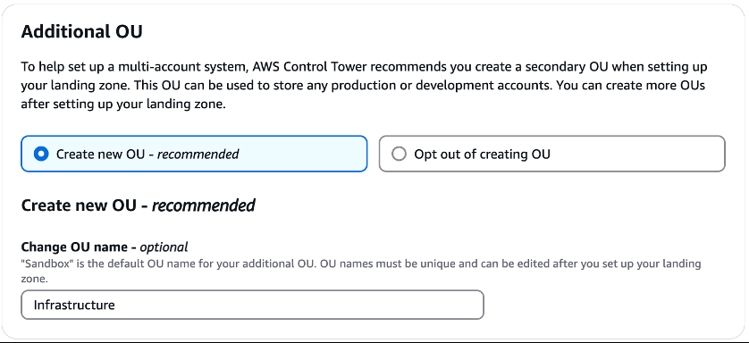
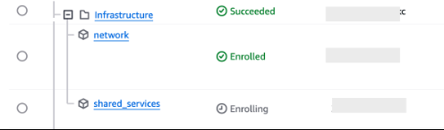

==== Step 5: Configure Control Tower

################################################
################################################
################################################
################################################

High-Level Summary
This step walks you through deploying Control Tower in GovCloud, using the previously created foundational accounts (Log Archive, Audit, Network, Shared Services), and enabling Control Tower governance across them.

You're:

Deploying a KMS key for Control Tower to use

Launching Control Tower in the GovCloud (US-West) region

Setting up Organizational Units (OUs) and assigning foundational accounts

Manually enrolling the Network and Shared Services accounts

🔐 Part 1 – Deploy the KMS Key Stack
You upload and deploy the CloudFormation template (the one you asked about earlier) that creates a customer-managed KMS key (alias/kms-key-for-control-tower).

This key:

Enables encryption for logs, configs, and other resources in Control Tower

Is required if you choose custom encryption during Control Tower setup

🏗️ Part 2 – Set Up Control Tower
You walk through the Control Tower setup wizard to deploy it into GovCloud. Key settings include:

Regions:

Home Region: AWS GovCloud (US-West)

Additional Region: AWS GovCloud (US-East)

OUs:

Foundational: Security (default)

Additional: Infrastructure (you add this manually)

Accounts:

Log_Archive → assigned to Security OU

Audit → assigned to Security OU

Encryption:

Enable KMS encryption

Choose your custom KMS key (alias/kms-key-for-control-tower)

Once launched, Control Tower will:

Create multiple CloudFormation StackSets in the enrolled accounts

Start sending compliance and notification emails to root addresses

🧾 Part 3 – Confirm SNS Subscription
You’ll get an email to confirm SNS subscription to security notifications (aws-controltower-AggregateSecurityNotifications).

✅ Confirm this to start receiving security alerts.

🧩 Part 4 – Enroll Remaining Accounts (Network + Shared Services)
After Control Tower is launched, it auto-enrolls Log Archive and Audit accounts.
You then manually enroll:

Network → into the Infrastructure OU

SharedServices → into the Infrastructure OU

Since these accounts were provisioned with the AWSControlTowerExecution role, manual authorization is not needed — even though the UI may mention it.

Once enrolled:

You’ll see the accounts listed in the Organization view under their assigned OUs

Status will eventually show "Enrolled"

🧰 What does Control Tower actually do here?
For each enrolled account, it deploys governance and monitoring resources via StackSets:

Roles: Baseline IAM roles for Control Tower management

Config: Enable AWS Config rules for compliance monitoring

CloudTrail: Log trail setup

CloudWatch: Logging and metrics

Service-linked roles: To allow AWS services to operate correctly

✅ Why this step matters:
This step is where your environment officially becomes a "Landing Zone", governed and monitored using AWS best practices. It sets the foundation for:

Guardrails

Security baselines

Account lifecycle management

Centralized logging and compliance

################################################
################################################
################################################
################################################

[start=1]
.	Login to the management account (IM-root-Mgt)
.	In the services search bar enter *CloudFormation* and select *CloudFormation*
.	Select *Create stack*
.   choose *With new resources (standard)*
.	Leave *Choose an existing template* selected
.	For *Specify template*, select *Upload a template file*
.	Select *Choose file*
.	Enter the path to the KMS key CloudFormation template
.	Select *Next*
.	For Stack name, enter *AWSControlTowerKMS*
.	Select *Next*
.	On the *Configure stack options* page, select *Next*
.	On the *Review and create*, scroll to the bottom and select *Submit*
.	You will be directed to the *Events – updated* tab
.	Wait for the stack to show *CREATE_COMPLETE*
.	In the services search bar, enter *Control Tower* and select *Control Tower*
.	Select *Set up landing zone*
.	Under *Home Region* ensure that *AWS GovCloud (US-West)* is selected
.	Under *Select additional Regions for governance*, select *AWS GovCloud (US-East)*

[start=19]
. Under *Region deny setting*, select *Enabled*

[start=20]
. Select *Next*
. Under *Foundational OU*, leave *Security*
. Under** Additional OU**, delete *Sandbox* and enter *Infrastructure*

[start=23]
. Select *Next*
. Under *Log archive account*, select *Browse Organization*
. Select the *Log_Archive* account

[start=26]
. Select *Confirm*
. Under *Audit account*, select *Browse Organization*
. Select the *Audit* account

[start=29]
.	Select *Confirm*
.	Select *Next*
.	Under *AWS account access configuration* leave *AWS Control Tower sets up AWS Account access with IAM Identity Center* selected
.	Under AWS CloudTrail configuration leave *Enabled* selected
.	Under *Log configuration for Amazon S3*, leave the defaults selected
.	Under *KMS Encryption*, select the box for *Enable and customize encryption settings*
.	Select the *Choose an AWS KMS key or enter an ARN* box
.	Type *control* and select the key named *kms-key-for-control-tower*
.	Under *AWS Backup* leave *Don’t enable AWS Backup* selected
.	Select *Next*
.	Scroll to the bottom of the *Review and set up landing zone* page and select the box next to *I understand the permissions AWS Control Tower will use. To administer AWS resources and enforce rules on my behalf. I also understand the guidance on the use of AWS Control Tower and the underlying AWS resources.*
.	Select *Set up landing zone*

You will be presented with a progress notification of the status of Control Tower configuration indicating that the process can take up to 60 minutes.

You must wait for this process to complete before continuing.  During this process, the root email account will receive an email titled *Invitation to join AWS IAM Identity Center*. This email can be ignored.  We do not want root emails to have an entry in AWS IAM Identity Center.

It will also receive an email with the subject *AWS Notification – Subscription Confirmation* indicating to confirm a subscription to the AWS SNS topic aws-controltower-AggregateSecurityNotifications.  Select the *Confirm subscription* link in the emails.

This will open a browser window indicating the subscription has been confirmed.

The root email will then begin receiving Control Tower security related alerts. During the Control Tower configuration, it will receive about 22 messages with the subject *Config rules compliance change*.  These messages can be archived.  When the Control Tower setup is complete, the following can be seen at the top of the dashboard.

During the process of configuration AWS Control Tower, the Security and Log_archive accounts are automatically added.

You will need to manually enroll the *Network* and *SharedServices* accounts.

[start=41]
. From the *Control Tower* console, select *Organization* from the menu
. Select the *Security OU* and verify that the *Audit* and *Log_Archive* accounts exist inside the OU and have the status of *Enrolled*

Note that the Accounts enrolled is showing 3 of 5.  This is because the *network* and *shared services* accounts are not Enrolled.

[start=43]
. Select the circle next to the *Network* account
. Select *Actions*
. Select *Enroll*
. Under *Configure account enrollment*, select *Infrastructure* in the *Organizational unit* drop down

There is nothing to do with regard to the notice in the *Authorize account* information box.  This was done when the account was provisioned when we set *AWSControlTowerExecution* to be the configuration role.

[start=47]
. Select *Enroll account*
. Select *Enroll account* on the pop-up.  You do not need to worry about the *You must manually authorize account before enrolling it* message on this pop-up.  Configuring *AWSControlTowerExecution* at the initial configuration steps, configured this for us.
. The following message will appear at the top of the page indicating the process has started

image::../../images/opt2-09-Step-5-Configure-Control-Tower-15.png[]

[start=50]
. There is no need for concern if you see the following message.  The account is being moved to the Infrastructure OU.

[start=51]
. Opening the Organization dashboard, the network account will appear under the Infrastructure OU and have a status of Enrolling. If you do not see the network account under the Infrastructure OU, select the refresh icon.

[start=52]
. Wait for the status to show *Enrolled*

[start=53]
. Select the circle next to the *Shared Services* account
. Select *Actions*
. Select *Enroll*
. Under *Configure account enrollment*, select *Infrastructure* in the *Organizational unit* drop down

There is nothing to do with regard to the notice in the *Authorize account* information box.  This was done when the account was provisioned when we set *AWSControlTowerExecution* to be the configuration role.

[start=57]
. Select *Enroll account*
. Select *Enroll account* on the pop-up.  You do not need to worry about the *You must manually authorize account before enrolling it* message on this pop-up.  Configuring *AWSControlTowerExecution* at the initial configuration steps, configured this for us.
. The following message will appear at the top of the page indicating the process has started

[start=60]
. There is no need for concern if you see the following message.  The account is being moved to the *Infrastructure* OU.

image::../../images/opt2-09-Step-5-Configure-Control-Tower-21.png[]

[start=61]
. Opening the *Organization* dashboard, the shared services account will appear under the Infrastructure OU and have a status of *Enrolling*. If you do not see the shared services account under the *Infrastructure* OU, select the refresh icon.

[start=62]
. This step is complete when you see the *network* and *shared services* accounts having a status of Enrolled

While the accounts are enrolling, several email messages will go to the root email for the audit account with the subject *Config Rules Compliance Change*.  Enrolling accounts in AWS Control Tower creates several CloudFormation stacks in the account that allow for Control Tower to manage the account.  These stacks are:

[start=1]
. StackSet-AWSControlTowerBP-BASELINE-SERVICE-ROLES-[HASH]
. StackSet-AWSControlTowerBP-BASELINE-ROLES-[HASH]
. StackSet-AWSControlTowerBP-BASELINE-SERVICE-LINKED-ROLE-[HASH]
. StackSet-AWSControlTowerBP-BASELINE-CLOUDWATCH-[HASH]
. StackSet-AWSControlTowerBP-BASELINE-CONFIG-[HASH]

