=== Step 6: Install Landing Zone Accelerator

This section describes the installation of the Landing Zone Accelerator on AWS solution.  This will put in place all the stacks and configurations that will then allow you to manage the Landing Zone via the solution.

The installation of the Landing Zone Accelerator on AWS depends on access to the public link:https://github.com/awslabs/landing-zone-accelerator-on-aws[GitHub repository] that stores the LZA code.  During the installation, the process will reach out to the GitHub repository, pull and build the code to deploy the solution to your account.  In order to do that, a GitHub developer key is required.

.Note
----
There is an alternative in which source code can be uploaded to S3.  If you will be following that process, you DO NOT need to configure the GitHub Developer Key. Skip this section and start at *Run LZA Installer Stack (Self-hosted LZA Source)*.
----

==== Configure GitHub Developer Key
To create the GitHub developer key:

[start=1]
. Log in to github.com
. Select your profile drop down from the upper right-hand side and select

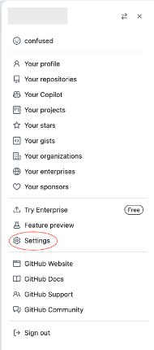

[start=3]
. Select Developer settings (located at the bottom)

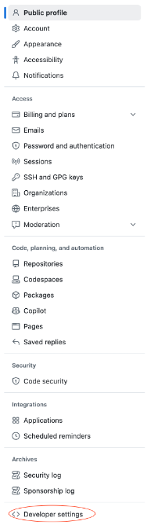

[start=4]
. Select *Personal access tokens* and then *Tokens (classic)*
. Select *Generate new token (beta)* from the *Generate new token* dropdown
. Enter a name for the token.  This name exists only for your account
. You can configure an expiration date for the token here
. Leave the *Public Repositories (read-only)* selected
. Select *Generate token*
. The token will then appear in a green box.  You will need to copy the key before moving to a new page as the key will not be visible again
. Login to you GovCloud management account
. From the Service search, type *Secrets* and select *Secrets Manager*
. Select *Store a new secret*
. Select *Other type of secret*
. Select *Plaintext*
. Delete any text in the box and paste your GitHub token.  The GitHub token should be the ONLY thing in the box.

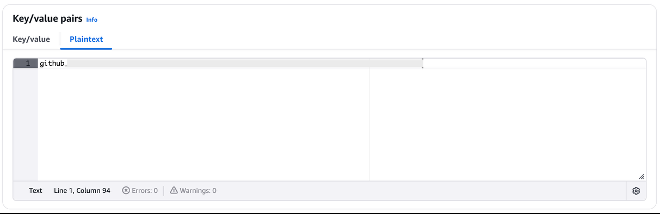

[start=17]
. Select *Next*
. For *Secret name* enter *accelerator/github-token*
. Enter a description (*GitHub token for Landing Zone accelerator*)
. Select *Next*
. Select *Next*
. Select *Store*
. If you see the next page stating No secrets, refresh the page

==== Run LZA Installer Stack (Self-hosted LZA Source)
Use this section if you will be getting the LZA source from GitHub and then copying it to S3.  

. Login to your management account and open the *S3* console
. Select *Create bucket*
. For bucket name, enter *lza-src-ACCOUNTID-REGION*. Replace *ACCOUNTID* and *REGION* with your appropriate information
. Under *Bucket Versioning* select *Enable*
. Under *Default Encryption*, select *Server-side encryption with AWS Key Management Service keys (SSE-KMS)*
. Select *Choose from your AWS KMS Keys*
. In the *Choose AWS KMS Key* drop down, select the key with the alias *aws/s3*
. Select *Create bucket
. Locally clone the LZA github repository by running *git clone https://github.com/awslabs/landing-zone-accelerator-on-aws.git*
. Note that the default branch is the latest version.  Run *git branch* to see the current version name
. Run *zip -q -T -r ../VERSION.zip .* where *VERSION* is the version of LZA to install
. Run *aws s3 cp ../VERSION.zip s3://BUCKET*.  Where *BUCKET* is the bucket you created in previous steps
. Run *cd source*
. Run *yarn install && yarn build*
. When that is complete change to *cd packages/\@aws-accelerator/installer/*
. Run *cdk synth --context use-s3-source=true --context s3-source-kms-key-arn=ARN* where *ARN* is the arn of your KMS Key you used in a previous step

This creates your installer CloudFormation template and places it in *cdk.out/AWSAccelerator-InstallerStack.template.json*

[start=17]
. From the Service search, type *CloudFormation* and select *CloudFormation*
. Select *Create stack* and *With new resources (standard)*
. Select *Upload a template file*
. Select the template file created in previous steps
. Select *Next*
. For *Stack name* enter *AWSAccelerator-InstallerStack*
. For *Source Location* select *s3*
. For *RepositoryBucketName* enter the name of the bucket created in previous steps (*lza-src-ACCOUNTID-REGION*)
. Continue to the section for *Continue with Installer Template Configuration*

==== Run LZA Installer Stack (GitHub Source Location)

[start=1]
. From the Service search, type *CloudFormation* and select *CloudFormation*
. Select *Create stack* and *With new resources (standard)*
. Leave *Choose an existing template* selected
. For Specify template leave *Amazon S3 URL* selected
. For *Amazon S3 URL*, paste the following:  *https://s3.amazonaws.com/solutions-reference/landing-zone-accelerator-on-aws/latest/AWSAccelerator-InstallerStack.template*

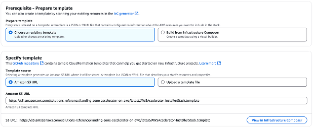

[start=6]
. Select *Next*
. For *Stack name* enter *AWSAccelerator-InstallerStack*

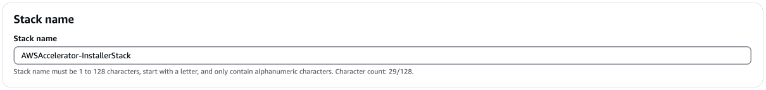

[start=8]
. Under *Parameters* > *Source Code Repository Configuration*, leave *Source Location*, *Repository Owner*, *Repository Name*, *Branch Name* with the default values.

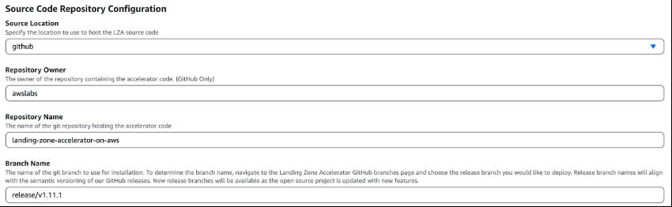

. Continue to the section for *Continue with Installer Template Configuration*

=== Continue with Installer Template Configuration

[start=9]
. Under *Pipeline Configuration*, configure an email address for *Manual Approval Stage notification email list*

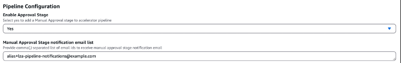

[start=10]
. For *Mandatory Accounts Configuration*, enter the *Management Account Email*, *Log Archive Account Email* and the *Audit Account Email*
. For *Environment Configuration*, select *Yes* for *Control Tower Environment* and default settings for *Accelerator Resource name prefix* and *Enable Diagnostics Pack*

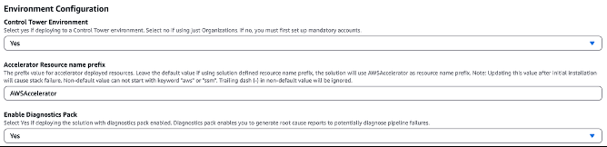

[start=12]
. For *Config Repository Configuration*, select s3 for *Configuration Repository Location* and leave everything else as defaults

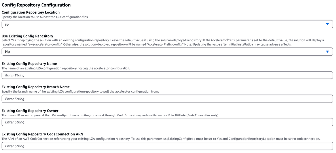

[start=13]
. Select *Next*
. Scroll the bottom of the *Configure stack options* page and select the checkbox next to *I acknowledge that AWS CloudFormation might create IAM resources*.

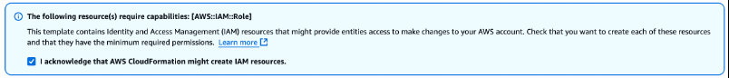

[start=15]
. Select *Next*
. Scroll to the bottom of the *Review and create* page and select *Submit*
. You will be directed to the *Events – updated* tab for the stack showing the stack as *CREATE_IN_PROGRESS*

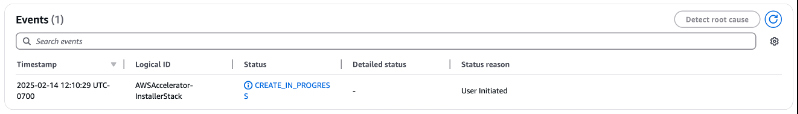

[start=18]
. Refresh the events table to view the events for CloudFormation

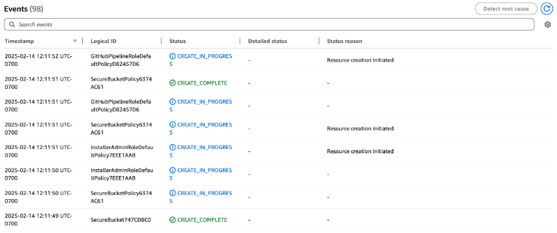

When the stack shows *CREATE_COMPLETE*:

[start=19]
. In the service search bar enter *CodePipeline* and select *CodePipeline*
. Here you will the *AWSAccelerator-Installer* pipeline with a status of *In progress*

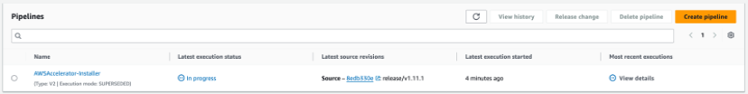

[start=21]
. Select *AWSAccelerator-Installer*
. You will see the *Install* stage displayed in blue indicating that the pipeline running

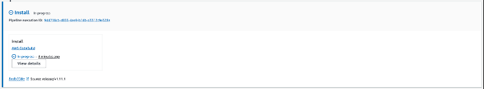

[start=23]
. Wait for the stage to be displayed in green to know when it is complete

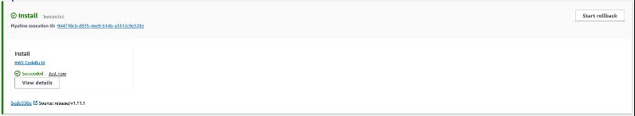

[start=24]
. If you navigate back to the Pipelines dashboard, you will now see the *AWSAccelerator-Pipeline* with the status of *In progress*.  This is the primary pipeline for the deployment of the LZA.  Moving forward, when making configuration changes to the LZA, this is the pipeline that will be triggered.
. Select *AWSAccelerator-Pipeline*
. You will see several stages in the pipeline.  Wait for the *Prepare* stage of the pipeline to Fail.  The pipeline will fail because a default set of configuration files was configured and used for this deployment.  These configuration files do not know about the *Network* and *Shared Services* accounts that were created.  The next steps will walk through downloading the configuration files and editing them to include the *Network* and *Shared Services* accounts.

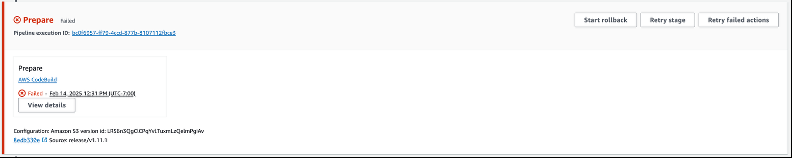

[start=27]
. Select *View details* from the failed *Prepare* stage
. On the pop-up, select *View in CodeBuild*
. On the build details page, you can see the log output from the build process.  Scroll down the page until you see text in red to see the error message. It will look similar to the following.  This is indicating that the *Prepare* process found discrepancies with what is in the configuration file versus what it discovered when polling the *AWS Organizations* service.

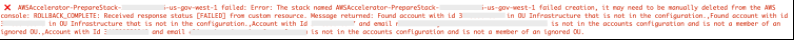

[start=30]
. From the services search bar, enter *s3* and select *S3*
. Select the bucket name that is prefixed with *aws-accelerator-config*
. Select *zipped*
. Select the square next to *aws-accelerator-config.zip*
. Select the *Actions* drop down and select *Download as*
. Select the link for the file

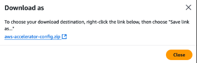

############################################################
############################################################
############################################################
 Ongoing Workflow from Here
Modify YAML config (e.g., add accounts, enable services, define guardrails)

Commit changes to your config repository

Pipeline deploys changes automatically across accounts

You stay compliant, secure, and scalable — all as code
############################################################
############################################################
############################################################

[start=36]
. Unzip *aws-accelerator-config.zip*
. Open the *accounts-config.yaml* file.  Note that the management, audit and log account already defined.
. After *workloadAccounts: []*, remove the *[]*
. Paste the following

[source,yaml]
----
- name: SharedServices
  description: Shared services account for GovCloud
  email: ACCOUNT_EMAIL
  organizationalUnit: Infrastructure
- name: Network
  description: Network account for GovCloud
  email: ACCOUNT_EMAIL
  organizationalUnit: Infrastructure
----

[start=40]
. Replace *ACCOUNT_EMAIL* with the root email address for the account.  The email address that was configured when the account was created.
. Save the file
. Zip the configurations files by running *zip -r aws-accelerator-config.zip .*
. Upload the file back to the S3 bucket by selecting *Upload* in the S3 console
. Select *Add files*
. Navigate to the file on your local machine and select it
. Select *Upload*
. If successful, you will see the following at the top of the page

[start=48]
. Select *Close*
. In the services search bar, enter *CloudFormation* and select *CloudFormation*
. Select the circle next to the stack that is prefixed with *AWSAccelerator-PrepareStack*-.  This stack will have a status of *ROLLBACK_COMPLETE*.
. Select *Stack actions* and then *Edit termination protection*

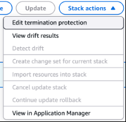

[start=52]
. Select *Deactivated*
. Select *Save*
. Navigate back to the *CodePipeline* console and select *AWSAccelerator-Pipeline* (the pipeline that shows a *Latest Execution status* of *Failed*)
. Select *Release change* to start the pipeline
. Select *Release*
. You will see the *Source* stage display blue indicating that the pipeline has started
. If you have the *Review* stage enabled, when the pipeline reaches the *Review* stage, select *Review*

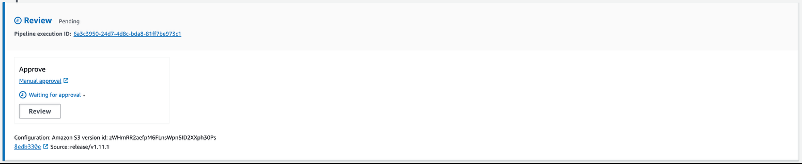

[start=59]
. On the pop-up, select *Approve*
. Select *Submit*
. Wait for the pipeline to complete.  It must complete all the way through the *Deploy* stage. The screen capture below shows the *Deploy* stage and its actions indicating *No executions yet*. It will take some time for the pipeline to execute

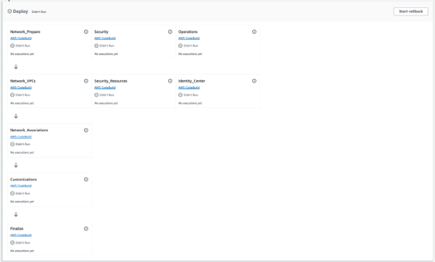

[start=62]
. Once completed, the *Deploy* stage shows all actions *Succeeded*, the pipeline has completed

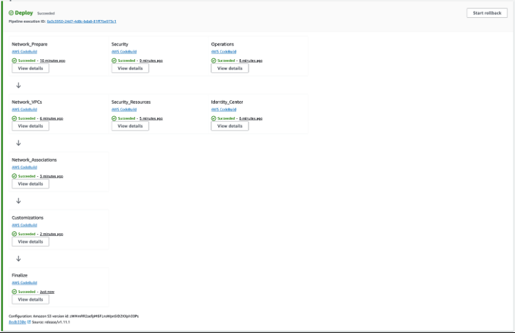

This completes the installation of the Landing Zone Accelerator solution.  The next steps will walk through the configuration of the environment.

###################################################################
###################################################################
###################################################################

 Automates and standardizes the foundation of your AWS environment, including:
✅ Account Structure & Governance
Automated creation of Log Archive, Audit, Network, and Shared Services accounts

Organization Units (OUs) like Security and Infrastructure

Enrolled under AWS Control Tower for continuous governance

✅ Security & Compliance
AWS Config rules, CloudTrail, and CloudWatch logging across accounts

Centralized logging to the Log Archive account

Custom KMS keys for encryption and auditing

Optional SNS notifications for security/compliance events

✅ Code-Based Deployment Pipeline
AWSAccelerator-Pipeline automates changes to the environment using:

YAML configuration files

CodePipeline and CodeBuild

You own and can version the configuration in your own Git repo

✅ Built for Corporate & Regulated Environments
The architecture aligns with best practices for:

Enterprise-scale governance

Separation of duties

Least privilege and auditability

Designed to support environments like GovCloud, FedRAMP, DoD IL5, etc.

🔁 Ongoing Workflow from Here
Modify YAML config (e.g., add accounts, enable services, define guardrails)

Commit changes to your config repository

Pipeline deploys changes automatically across accounts

You stay compliant, secure, and scalable — all as code

###################################################################
###################################################################
###################################################################