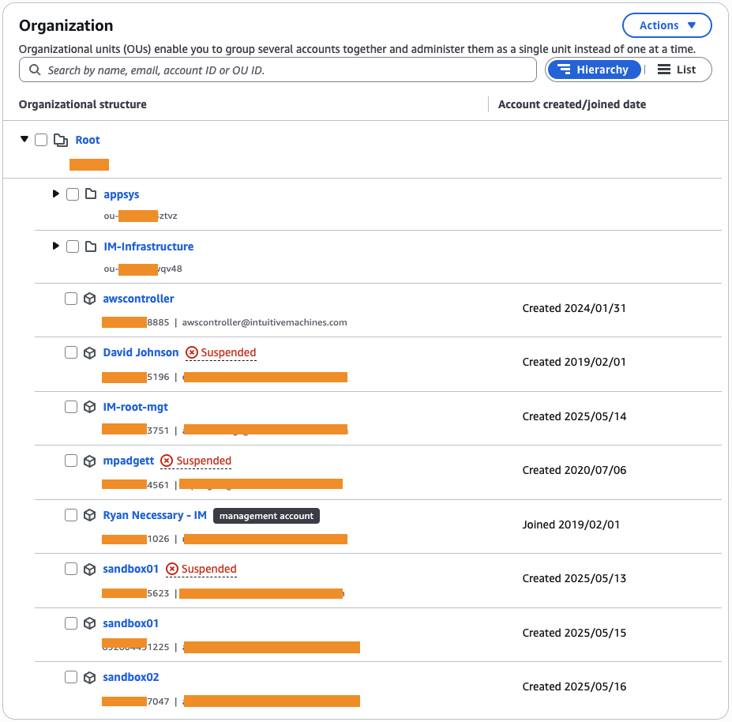
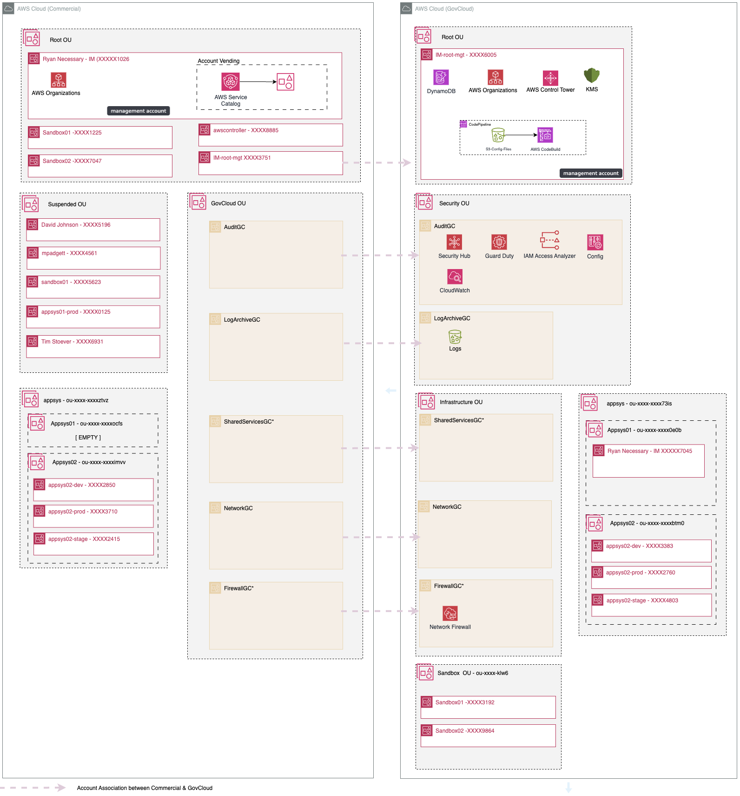

= Implementation Discussion

=== Wednesday, July 16, 2025

This document outlines an implementation planned for the landing zone accelerator for Intuitive Machines.

'''
[start=1]
. [ ] Discuss source location

.Notes
----

There are two options for where the source code can be located.  Option1 is for the source code to be pulled from GitHub repository owned by AWS.  The second option is to house the documentaiton in S3.  The latter would require for the source code to be cloned locally and zipped and placed in S3. 

Phil: I would prefer to start with cloning the repo. We have little to no experience with CICD pipeline style procedures. Would it be better to use a Gitlab Repo for that versus S3?

Alex (AWS): There only options available at the moment for pulling source are GitHub and S3.  You would not be editing these source files.  

It doesn't mean that GitLab can't be used.  One option would be:

1. Clone GitHub Repo locally
2. Push to GitLab repo
3. Create Gitlab CI that can zip and copy the source to S3

Solution:
We will pull source from Github and use developer key.

----

'''

[start=2]
. [ ] Discuss email addresses

.Notes
----

Phil: I’m not familiar with the ‘+’ notation. We are currently using DLs. Also, I don’t see the gain in prefixing the emails with ‘IM’ as the domain is ‘intuitivemachines’. The ‘+’ notation does seem like  a good idea though. Let’s work through a migration plan when we can. 
 

Alex (AWS):   the prefix was just there to have text for an example.  Using `iam-aws` as the prefix was just to demonstrate the pattern of using + notation.  We can make it whatever we want.

----

Solution:

will use one mailbox as aws-accounts@intuitivemachines.com.  Reagan will create.  We will then use + notation.

aws-accounts+auditgc@intuitivemachines.com

'''

[start=3]
. Discuss Commercial Organizations structure

.Suggestions
----
* [ ] Rename `Ryan Necessary - IM` to a name that denotes it as the management account. - This is the Organizations Management account for Commercial.
* [ ] Create a *Suspended* OU and move *Suspended* accounts into it.
* [ ] Create a *Sandbox* OU and move *Sandbox* accounts into it. - Not really necessary, we won't apply any SCPs here.
* [ ] We will create a GovCloud OU for govcloud accounts - This will locak down and house the commercial accounts mapped to the GovCloud accounts.

* [ ] Discuss `IM-root-mgt` - This looks to be the commercial account mapped to the GovCloud account that is the Organizations management account for GovCloud Org.
* [ ] We will NOT apply SCPs to existing OUs
----

.#Concerns#
----
I noticed that you have account `Ryan Necessary - IM` as the management account for Organizations in commercial and you have another account, `IM-root-mgt` that has a GovCloud account associated with it that is the management account for Organizations in GovCloud.

For implementing an account vending process for new GovCloud accounts, there's an important AWS architectural requirement we need to address:

Key point: GovCloud accounts can only be created from the commercial AWS Organizations management account using the CreateGovCloudAccount API.

This is because:

The commercial and GovCloud regions operate as separate partitions with different security boundaries

GovCloud accounts are always created as pairs - a commercial account linked to a GovCloud account

The commercial account must be created first, then the GovCloud counterpart is automatically provisioned

Your current setup has the commercial member account linked to your GovCloud management account. While this works for managing existing GovCloud accounts, the account vending process must be installed on your commercial management account to create new GovCloud accounts.

Would you like me to help design an approach that maintains your current structure while adding the account vending capability to your commercial management account?

https://docs.aws.amazon.com/organizations/latest/APIReference/API_CreateGovCloudAccount.html

----

'''

[start=4]
. [  ] Install GovCloud Vending into Commercial management account (*~.5 hours*)
. [  ] Create GovCloud Accounts via vending process (*~1.5 hours*)
. [  ] Configure Control Tower (*~1.5 hours*)
. [  ] Configure foundational LZA in GovCloud (*~1.5 hours*)

This puts us in a place to discuss networking and workloads.

'''

Phil: There’s a concept in the OU/VPC construct that confuses me a little, would you be able to put this on the docket to help me understand, please.
 
One reason for using OUs and different accounts is described as a security control. For example, AWS backups are looking to set up backups for the ‘Security OU’. The docs also mention setting up a Central and Backup account for said config. My disconnect is how do those accounts get configured for this security control? I’m thinking that it would be a permission set in IC?
 
I’m just having a hard time wrapping my head around using the different accounts for different roles & security…

https://docs.aws.amazon.com/controltower/latest/userguide/enable-backup.html

Alex (AWS):

Setting up Backups for control tower gives you:

- An AWS Backup Administrator account (Delegated Administrator)
- An AWS Backup Central Backup account

2. When you activate backups for your landing zone, AWS Control Tower:
- Establishes these two accounts you've provided as the Central Backup and Backup Administrator accounts
- Creates necessary resources in these accounts and other accounts
- Creates a local backup role (aws-controltower-backup-role) in your accounts with specific permissions and managed policies:
  - AWSBackupServiceRolePolicyForBackup
  - AWSBackupServiceRolePolicyForRestores
  - AWSBackupServiceRolePolicyForS3Backup
  - AWSBackupServiceRolePolicyForS3Restore

3. For the Security OU specifically, the document mentions that to enable backups for the AWS Control Tower Audit and Log Archive accounts, you must set up backups for the Security OU by calling the EnableBaseline API.

However, the specific details about how these accounts get configured through Identity Center (IC) permission sets is not covered in the provided document. The document focuses more on the backup configuration process rather than the initial account setup and permission management through Identity Center.

The document shows that the security controls are implemented through IAM roles and policies specific to AWS Backup, but doesn't detail the Identity Center configuration aspects you're asking about.

What is a delegated administrator?
A delegated administrator account is a member account in an AWS Organization that is given permissions to administer specific AWS services on behalf of the entire organization, instead of managing everything through the management account.

Key points about delegated administrator accounts:

Purpose:
Follows security best practice of limiting access to the management account
Provides administrative capabilities for specific services across the organization
Enables distributed management responsibilities

The delegated administrator account for AWS Backup has several key responsibilities:

. Cross-Account Backup Management:

* Create and manage backup policies across the organization
* Apply backup policies to organizational units (OUs)
* Monitor backup activities across all accounts
* Manage cross-account backup access

. Centralized Control:

* Configure backup settings organization-wide
* Define backup schedules and retention rules
* Create and manage backup plans
* Set up cross-region backup copies

. Monitoring and Reporting:

* View backup status across all accounts
* Monitor backup jobs and restore activities
* Access consolidated backup reports
* Track compliance with backup policies

. Policy Administration:

* Create and manage backup vault policies
* Set up cross-account access policies
* Define backup resource policies
* Implement backup compliance rules

. Recovery Operations:

* Manage restore operations across accounts
* Control access to backup vaults
* Coordinate cross-account recoveries
* Handle backup retention management

 LZA is different. When you deploy backup via LZA it creates the vaults and backup plans in the target accounts, not a centralized account.  If we want to do the centralized approach, we can configure this manually.  I can show what the LZA deployment looks like from the lab account.

* Tagging policy*
 creator  [userid]
 creeated 2025-07-25